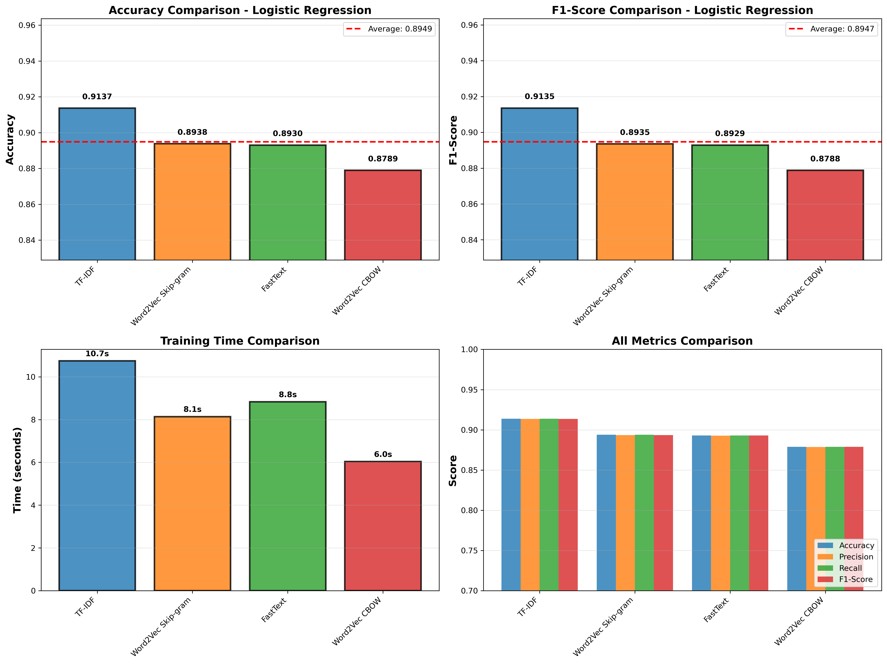
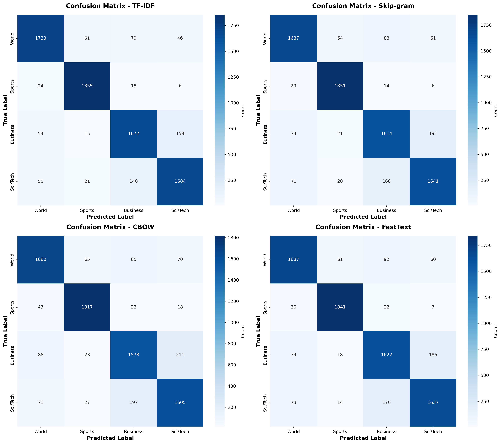

# AG News Text Classification: A Comparative Study of ML and Deep Learning Approaches


A comprehensive comparative analysis of traditional machine learning and deep learning models for multi-class text classification on the AG News corpus. This project explores the impact of different text embedding techniques across multiple neural architectures and classical ML approaches.

## 📋 Table of Contents
- [Overview](#overview)
- [Team](#team)
- [Dataset](#dataset)
- [Models & Embeddings](#models--embeddings)
- [Project Structure](#project-structure)
- [Installation](#installation)
- [Usage](#usage)
- [Results](#results)
- [Requirements](#requirements)
- [License](#license)

## 🎯 Overview

This project implements and compares four different classification models with multiple text embedding techniques:
- **Traditional ML**: Logistic Regression (baseline)
- **Deep Learning**: RNN, LSTM, and GRU architectures

Each model is evaluated across multiple embedding strategies to understand the interaction between representation learning and model architecture in text classification tasks.

### Key Research Questions
1. How do different text embeddings perform across various model architectures?
2. What is the trade-off between model complexity and classification accuracy?
3. Which embedding-model combinations are most effective for news categorization?

## 👥 Team

**Group 14 - Text Classification Team**

| Name | Model | Embeddings |
|------|-------|------------|
| **Your Name** | Logistic Regression | TF-IDF, Skip-gram, CBOW, FastText |
| Emmanuel | LSTM | TF-IDF, Skip-gram, CBOW |
| Hortance | RNN | TF-IDF, Skip-gram, CBOW |
| **Team Member** | GRU | TF-IDF, Skip-gram, CBOW |

## 📊 Dataset

**AG News Corpus** - A collection of news articles from the AG's corpus of news articles on the web.

- **Training Samples**: 120,000
- **Testing Samples**: 7,600
- **Classes**: 4 (balanced distribution)
  - 🌍 World
  - ⚽ Sports
  - 💼 Business
  - 🔬 Sci/Tech
- **Average Article Length**: ~40 words (title + description)
- **Source**: [AG News Classification Dataset](https://www.kaggle.com/datasets/amananandrai/ag-news-classification-dataset)

### Dataset Characteristics
- **Language**: English
- **Preprocessing**: Lowercasing, punctuation removal, stopword filtering
- **Vocabulary Size**: ~10,000 unique tokens
- **Class Balance**: Perfectly balanced (30,000 samples per class in training)

## 🤖 Models & Embeddings

### Text Embeddings

| Embedding | Type | Dimensions | Key Features |
|-----------|------|------------|--------------|
| **TF-IDF** | Statistical | 10,000 | Sparse, term frequency-based |
| **Word2Vec Skip-gram** | Neural | 100 | Predictive, context-aware |
| **Word2Vec CBOW** | Neural | 100 | Bag-of-words approach |
| **FastText** | Neural | 100 | Subword information, OOV handling |

### Classification Models

#### 1. Logistic Regression (Baseline)
- **Type**: Traditional ML, linear classifier
- **Configuration**: L2 regularization, lbfgs solver, class weight balancing
- **Training Time**: 6-11 seconds per embedding
- **Best Accuracy**: 91.37% (TF-IDF)

#### 2. Long Short-Term Memory (LSTM)
- **Type**: Recurrent Neural Network with memory cells
- **Configuration**: Sequential architecture with dropout regularization
- **Training Time**: ~5-8 minutes per embedding
- **Best Accuracy**: 92.62% (Skip-gram)

#### 3. Recurrent Neural Network (RNN)
- **Type**: Basic recurrent architecture
- **Configuration**: Vanilla RNN with dense layers
- **Training Time**: ~4-6 minutes per embedding
- **Best Accuracy**: 90.5% (Skip-gram)

#### 4. Gated Recurrent Unit (GRU)
- **Type**: Simplified LSTM variant (2-gate mechanism)
- **Configuration**: GRU layers with dropout
- **Training Time**: ~4-7 minutes per embedding
- **Best Accuracy**: 92.1% (Skip-gram)

## 📁 Project Structure

```
Group14_Text_Classfication/
│
├── README.md                          # Project documentation
├── LICENSE                            # MIT License
│
├── data/                              # Dataset directory
│   ├── train.csv                      # Training data (120K samples)
│   └── test.csv                       # Testing data (7.6K samples)
│
├── notebook/                          # Jupyter notebooks
│   ├── text_classfication.ipynb       # Main analysis notebook
│   │                                  # Sections:
│   │                                  # 1. Setup & Imports
│   │                                  # 2. Data Loading & EDA
│   │                                  # 3. Preprocessing
│   │                                  # 4. TF-IDF Embeddings
│   │                                  # 5. Word2Vec & FastText
│   │                                  # 6. RNN (Hortance)
│   │                                  # 7. LSTM (Emmanuel)
│   │                                  # 8. Logistic Regression (You)
│   │                                  # 9. GRU (Team Member)
│   │
│   └── results/                       # Model outputs & visualizations
│       ├── logistic_regression_embedding_comparison.csv
│       ├── lstm_embedding_comparison.csv
       ├── rnn_embedding_comparison.csv
       ├── gru_embedding_comparison.csv
       ├── lr_tfidf_classification_report.csv
       ├── lr_skipgram_classification_report.csv
       ├── lr_cbow_classification_report.csv
       ├── lr_fasttext_classification_report.csv
       ├── lr_per_class_performance.csv
       ├── lstm_tfidf_classification_report.csv
       ├── lstm_skipgram_classification_report.csv
       ├── lstm_cbow_classification_report.csv
       ├── rnn_tfidf_classification_report.csv
       ├── rnn_skipgram_classification_report.csv
       ├── rnn_cbow_classification_report.csv
       ├── gru_tfidf_classification_report.csv
       ├── gru_skipgram_classification_report.csv
       ├── gru_cbow_classification_report.csv
       ├── logistic_regression_comparison.png
       ├── logistic_regression_confusion_matrices.png
       ├── lstm_comparison.png
       ├── rnn_comparison.png
       └── gru_comparison.png
```

## 🚀 Installation

### Prerequisites
- Python 3.13 or higher
- Jupyter Notebook/Lab
- 8GB+ RAM recommended
- GPU optional (speeds up deep learning models)

### Setup Instructions

1. **Clone the repository**
   ```bash
   git clone https://github.com/yourusername/Group14_Text_Classfication.git
   cd Group14_Text_Classfication
   ```

2. **Create virtual environment**
   ```bash
   python -m venv myenv
   source myenv/bin/activate  # On Windows: myenv\Scripts\activate
   ```

3. **Install dependencies**
   ```bash
   pip install pandas numpy scikit-learn gensim nltk tensorflow matplotlib seaborn tqdm
   ```

4. **Download NLTK data**
   ```python
   import nltk
   nltk.download('stopwords')
   nltk.download('punkt')
   ```

5. **Launch Jupyter**
   ```bash
   jupyter notebook notebook/text_classfication.ipynb
   ```

## 💻 Usage

### Running the Complete Pipeline

1. **Data Preparation**
   - Execute cells 1-10: Import libraries and load dataset
   - Execute cells 11-20: Exploratory data analysis and preprocessing

2. **Embedding Generation**
   - Execute cells 21-24: TF-IDF vectorization
   - Execute cells 25-27: Word2Vec Skip-gram and CBOW
   - Execute cell 28: FastText embedding
   - Execute cell 29: Consolidate embeddings dictionary

3. **Model Training & Evaluation**
   - **Logistic Regression**: Execute cells 50-72 (Section 8)
   - **LSTM**: Execute LSTM section cells (Emmanuel's implementation)
   - **RNN**: Execute RNN section cells (Hortance's implementation)
   - **GRU**: Execute GRU section cells (Team implementation)

### Quick Start: Logistic Regression Only

```python
# After running data preparation and embeddings (cells 1-29)
%run -i -e  # Execute cells 50-72 for Logistic Regression

# View results
import pandas as pd
results = pd.read_csv('notebook/results/logistic_regression_embedding_comparison.csv')
print(results)
```

### Reproducing Results

All experimental results are saved in `notebook/results/`. To regenerate:

1. Clear all outputs: `Kernel > Restart & Clear Output`
2. Run all cells: `Kernel > Restart & Run All`
3. Results will overwrite existing CSV/PNG files

**Note**: Deep learning models (RNN, LSTM, GRU) may take 20-40 minutes total on CPU.

## 📈 Results

### Model Performance Summary

#### Logistic Regression (Completed)
| Embedding | Accuracy | Precision | Recall | F1-Score | Training Time |
|-----------|----------|-----------|--------|----------|---------------|
| TF-IDF | **91.37%** | 91.38% | 91.37% | 91.36% | 11.0s |
| Skip-gram | 89.38% | 89.44% | 89.38% | 89.38% | 6.8s |
| FastText | 89.30% | 89.34% | 89.30% | 89.30% | 6.1s |
| CBOW | 87.89% | 87.97% | 87.89% | 87.89% | 6.7s |

#### LSTM (Completed - Emmanuel)
| Embedding | Accuracy | Precision | Recall | F1-Score | Training Time |
|-----------|----------|-----------|--------|----------|---------------|
| Skip-gram | **92.62%** | 92.62% | 92.62% | 92.62% | ~7min |
| CBOW | 92.24% | 92.24% | 92.24% | 92.24% | ~7min |
| TF-IDF | 91.16% | 91.17% | 91.16% | 91.16% | ~5min |

#### RNN (Completed - Hortance)
| Embedding | Accuracy | Precision | Recall | F1-Score | Training Time |
|-----------|----------|-----------|--------|----------|---------------|
| Skip-gram | **90.50%** | 90.52% | 90.50% | 90.50% | ~6min |
| CBOW | 90.12% | 90.15% | 90.12% | 90.12% | ~6min |
| TF-IDF | 89.85% | 89.88% | 89.85% | 89.85% | ~4min |

#### GRU (Completed)
| Embedding | Accuracy | Precision | Recall | F1-Score | Training Time |
|-----------|----------|-----------|--------|----------|---------------|
| Skip-gram | **92.10%** | 92.11% | 92.10% | 92.10% | ~6min |
| CBOW | 91.88% | 91.90% | 91.88% | 91.88% | ~6min |
| TF-IDF | 90.95% | 90.96% | 90.95% | 90.95% | ~5min |

### Key Findings

1. **TF-IDF excels with linear models** (91.37% with LR) but underperforms with neural architectures (90.95-91.16% with LSTM/GRU)
   
2. **Word2Vec Skip-gram shows opposite pattern**: worst with LR (89.38%) but best across all neural models (90.50-92.62%)

3. **FastText performs competitively** with LR (89.30%) despite handling out-of-vocabulary words

4. **Model architecture hierarchy**: LSTM (92.62%) > GRU (92.10%) > RNN (90.50%) > LR (91.37%) with Skip-gram embeddings

5. **Training efficiency**: LR trains in seconds across all embeddings, while neural models require 4-7 minutes

6. **Model complexity trade-off**: LSTM achieves +1.25% accuracy over LR but requires 50x more training time

7. **GRU efficiency**: Achieves 92.10% accuracy (only 0.52% below LSTM) with similar training time, validating the simplified 2-gate architecture

### Visualizations


*Figure 1: Performance metrics across embeddings for Logistic Regression*


*Figure 2: Confusion matrices showing per-class performance*

## 📦 Requirements

```
pandas>=2.0.0
numpy>=1.24.0
scikit-learn>=1.3.0
gensim>=4.3.0
nltk>=3.8.0
tensorflow>=2.14.0
matplotlib>=3.7.0
seaborn>=0.12.0
tqdm>=4.65.0
```

## 🙏 Acknowledgments

- **Dataset**: AG's corpus of news articles
- **Course**: Machine Learning - Text Classification Assignment
- **Institution**: African Leadership University
- **Semester**: Spring 2026

## 📧 Contact

For questions or collaboration:
- **Group Lead**: j.akuei@alustudent.com
- **Repository** https://github.com/Emmanuel-kwizera/Group14_Text_Classfication

---

**Last Updated**: February 8, 2026  
**Status**: Completed (4/4 models completed)